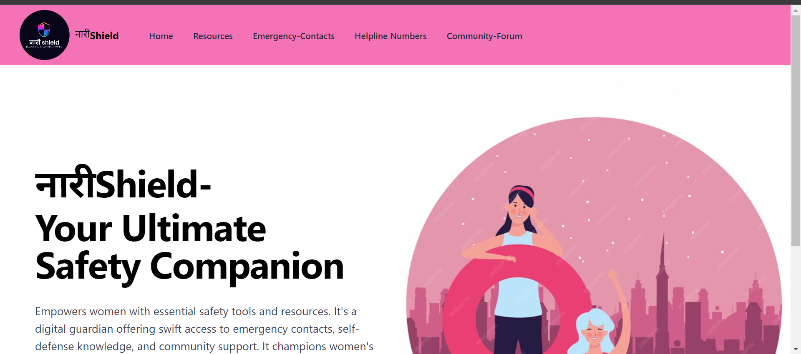
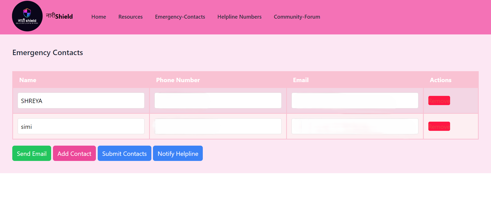
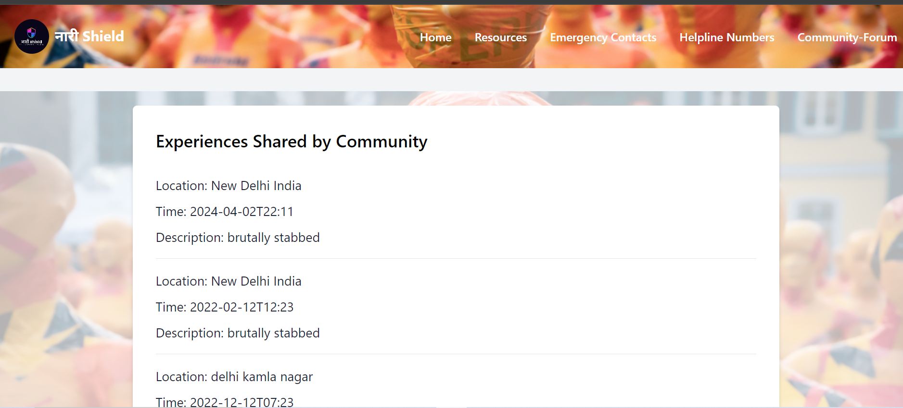
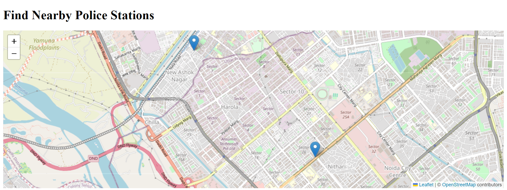

## Women Security App NAARISHIELD- Read Me

Welcome to our Women Security App! Your safety is our top priority, and we're here to empower you with tools and features designed to keep you safe and secure. Below are some key points to help you navigate and utilize the app effectively:

## Features
-  **It also help us to locate the nearby police stations in any emergency,supportive community forum, access to valuable resources, andvirtual self-defense classes.**
-  **Community forum where women can share experiences, find help in emergency situations, and can be self aware.**
-  **Connect with experts and learn vital self-protection skills from the comfort of their homes.**
-  **Can get the map direction of nearby police stations.**

## 📷 Screenshots

## NaariShield Installation Guide
This installation guide will help you set up the NaariShield application on your device effectively. Please follow the steps below:

## Prerequisites:
Ensure that you have a compatible device running either Android or iOS operating system.
Make sure you have a stable internet connection to download the NaariShield application.
Allow necessary permissions such as location access, contacts access, and notifications for optimal functionality.

## Installation Steps:

## Clone the Repository:
git clone https://github.com/guptashreya12/Women--NAARISHIELD-.git

## Navigate to the Directory:
Open your terminal or command prompt and navigate to the directory where you have cloned the NaariShield repository.

## Install Dependencies:
npm install

## Start the Application:
npm start

## Accessing the Application:
http://localhost:3000

## API
To use Leaflet in your project, you'll need to include it as a dependency.
You can install Leaflet via npm if you're using Node.js in your project:

npm install leaflet

## Testing
Once configured, thoroughly test the functionality of the NaariShield application to ensure that all features, including emergency assistance, location tracking, and notifications, are working as expected.

## Deployed Link
https://github.com/guptashreya12/Women--NAARISHIELD-
